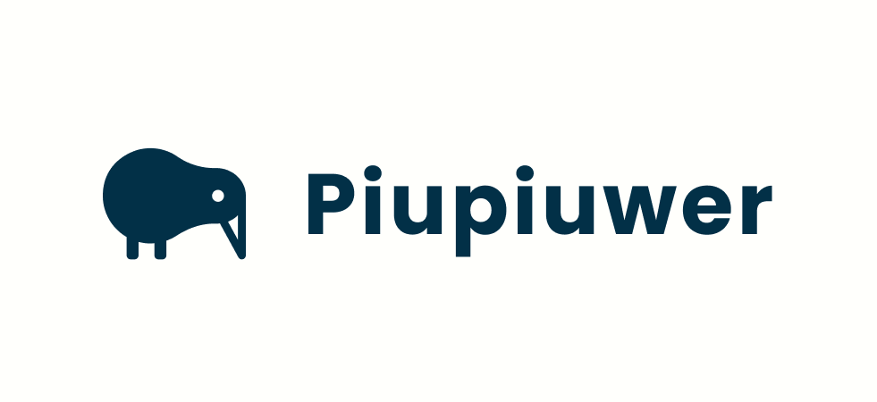
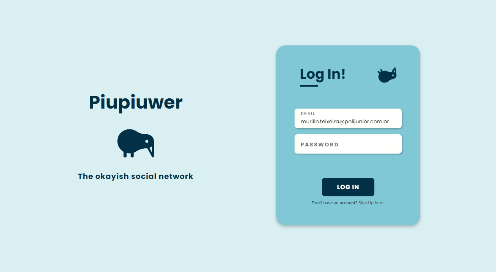
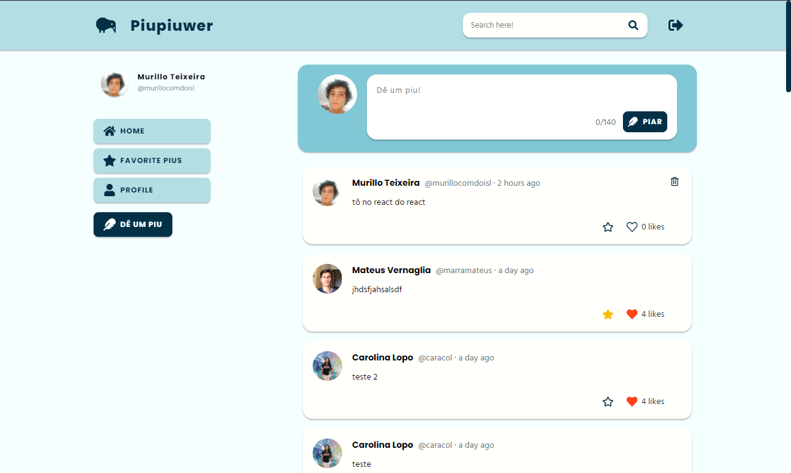
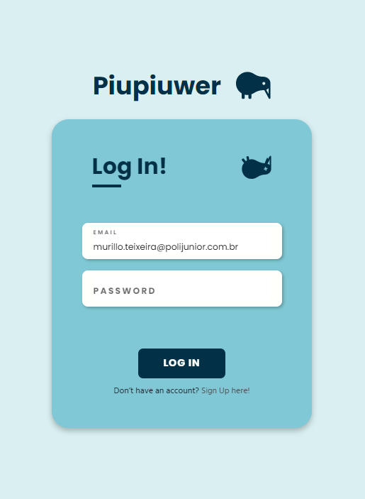
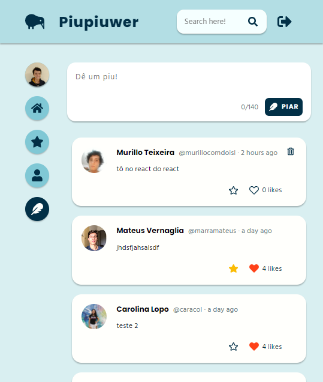

<h1 align="center">
    
</h1>

<h1 align="center">
   🥝 <a href="https://piupiuwer.vercel.app/login"> Piupiuwer em ReactJS </a>
</h1>

<h3 align="center">
    Rede social inspirada no Twitter criada como parte do treinamento de ReactJS da <a href="https://github.com/polijr">@polijr</a>
</h3>

<h4 align="center"> 
	 Status: Entregue
</h4>

 <a href="#sobre">Sobre</a> •
 <a href="#funcionalidades">Deploy</a> •
 <a href="#funcionalidades">Funcionalidades</a> •
 <a href="#layout">Layout</a> • 
 <a href="#tecnologias">Tecnologias</a>

## Sobre

🥝 Piupiuwer em ReactJS  - Projeto tradicionalmente construído pelos trainees do Núcleo de Tecnologia da Poli Jr. como parte do treinamento em ReactJS. Consiste no front-end de uma rede social inspirada pelo Twitter! A aplicação foi criada em partes, desde sua prototipagem até a implementação em ReactJS.

---

## Funcionalidades

- [x] Tela de Login
   - [x] Apenas os usuários registrados no banco de dados podem se logar.
   - [x] Caso algum dos inputs do usuário esteja incorreto, uma mensagem informando esse erro deve aparecer.
   - [x] Um sistema de armazenamento de conta e login automático.
   - [x] Implementar a autenticação.

- [x] Tela de Feed
   - [x] Devem aparecer todos os pius do banco de dados
   - [x] Os pius devem ser mostrados em ordem cronológica (mais recentes no topo)
   - [x] Devem existir interações com o piu
        - Favoritar o piu
        - Curtir o piu
        - Deletar pius próprios
   - [x] Deve haver uma caixa para enviar novos pius válidos e registrá-los no banco de dados

---

## Deploy

O deploy da aplicação foi feito usando a plataforma Vercel! E o resultado pode ser acessado [aqui](https://piupiuwer.vercel.app/).

Infelizmente repositórios do GitHub Classes não se enquadram na categoria de Hobby da Vercel, então fiz o deploy usando um repositório particular privado.

---

## Layout

O layout da aplicação pode ser conferido no Figma:

### Web

  

  

### Mobile

  

  

---

## Tecnologias

As seguintes tecnologias foram usadas no projeto:

-   **[React](https://reactjs.org/)**
-   **[TypeScript](https://www.typescriptlang.org/)**
-   **[Axios](https://github.com/axios/axios)**
-   **[Styled Components](https://styled-components.com/)**
-   **[React Loader Spinner](https://www.npmjs.com/package/react-loader-spinner)**
-   **[Moment JS](https://momentjs.com/)**
-   **[Vercel](https://vercel.com/)**
